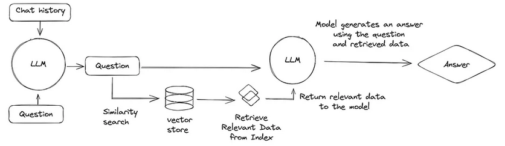

# Megawatt Onboarding AI Chatbot
> An AI-powered onboarding assistant that helps new employees get up to speed by answering questions using company data from Slack messages, emails, and internal wiki pages.  Powered by a local RAG (Retrieval-Augmented Generation) pipeline with LangChain, Chroma, and an Ollama-hosted LLM.

## Architecture


**Overview** (*How it works*): 
1. Company data is preprocessed and embedded into a local vector database.
2. A user submits a query to the chatbot.
3. The chatbot embeds the query and performs a similarity search in the vector database.
4. The retrieved context and query are passed to a local LLM (Ollama) to generate an accurate and context-aware response.


**Tools Used**
- **Embedding & Vector Store**: [HuggingFace Transformers](https://huggingface.co/sentence-transformers/all-MiniLM-L6-v2), [ChromaDB](https://www.trychroma.com/)
- **RAG Orchestration**: [LangChain](https://www.langchain.com/)
- **Local LLM**: [Ollama](https://ollama.com/)
- **Backend**: [Flask](https://flask.palletsprojects.com/en/stable/)
- **Deployment**: [Docker](https://www.docker.com/)

### Main File
The `main.py` file runs everything together.
There are initial constants at the beginning of the file like the database, slack, and google path.  These are used throughout, so they are easy to reconfigure.  The embedding model is also listed here and can be changed easily as well.  (Take note if the embedding model changes, it may require you to also recalculate the entire database).  I've listed the classes I've made and used here in the main file.
- **Indexer**
```python
class SlackIndexer:
   def __init__(self,
               slack_dir: str,
               db_path: str,
               embeddings,
               chunk_size: int = 1000,
               chunk_overlap: int = 200
               ):
```
- **Database Connector**
```python
class VectorSearcher:
  def __init__(self,
              db_path: str,
              embeddings
              ):
```
- **RAG Engine**
```python
class OllamaLLM:
    def __init__(self, model: str = "llama3.2"):
```
### Pipeline Folder
This folder has subfolders and a rag engine to do the heavy lifting and computation of the chatbot.
###### Preprocessing Folder
- **Embedding**: The `indexer.py` file inside this folder has two classes, one for Slack and one for Google.  These classes both go to the `data/slack/` and `data/google/` folders and read the given data into the program.  Then the data gets indexed and vectorized into a Chroma vector database.  The vectorization is done by a HuggingFace model that embeds the semantic meaning of text into the database.
- **Storing**: The vector database is a Chromadb and is stored in `database/folder`.  This database can then be searched through to find the nearest k-map of vectors from a query later on.
###### Retrievel Folder
- `database_connector.py` handles vector similarity search.
- The query is embedded and used to retrieve the top-k most relevant vectors using cosine similarity.
###### RAG Engine File
- `rag_engine.py` connects everything: it receives a query, retrieves relevant context, and prompts the Ollama LLM to return a final answer.

### Interface Folder
Working on this...

### Deploy Folder
Working on this...

## Setup Instructions
- Unzip slack data into data/slack folder and name `mw_slack`
#### Updating data to the model
- *Slack data*: Just unzip the slack zip file and place it in 'data/update/mw_slack' folder as labeled `mw_slack`.  Then exit out of the program and rerun the program, this will take a while (a couple minutes).  Last, **make sure to delete the `data/update/mw_slack` folder after the program has finished updating.**
- *Google data*: 
